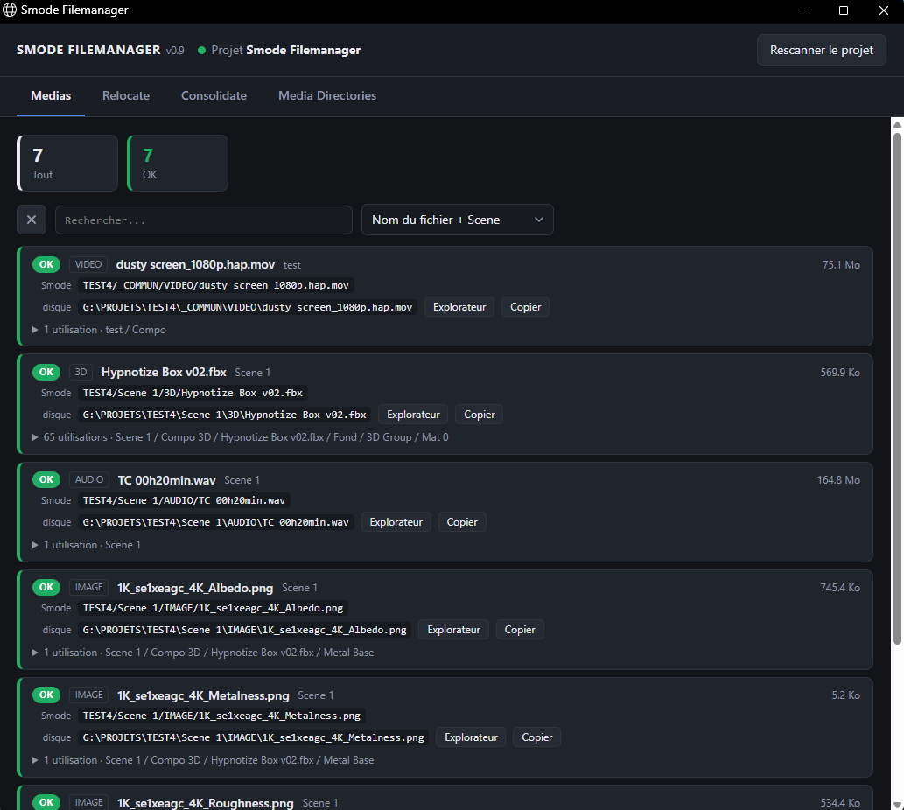
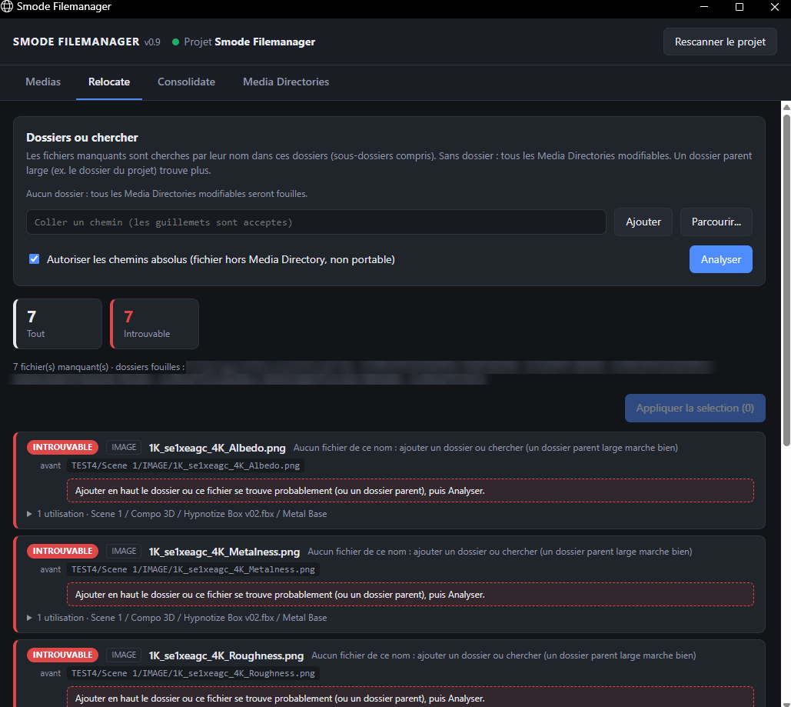
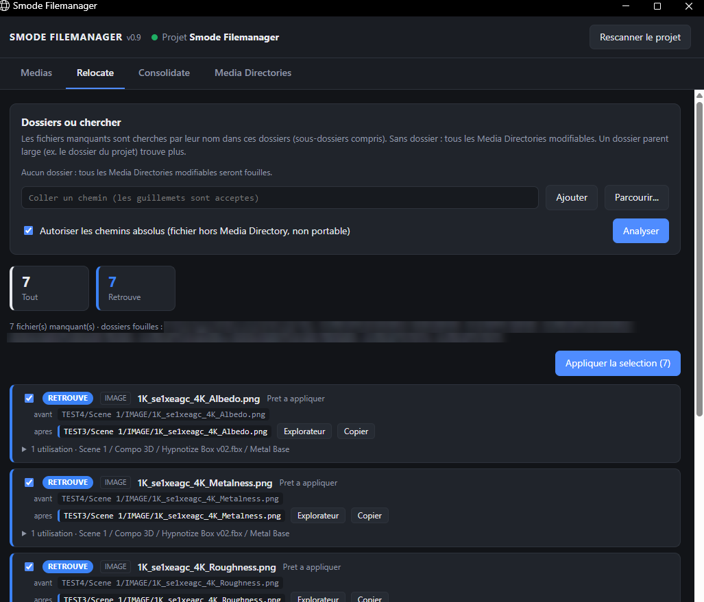
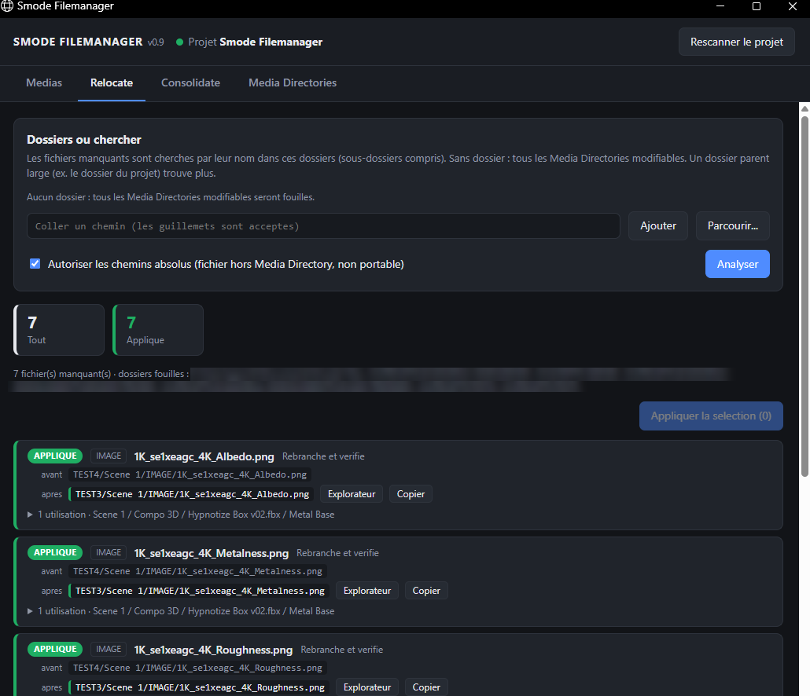
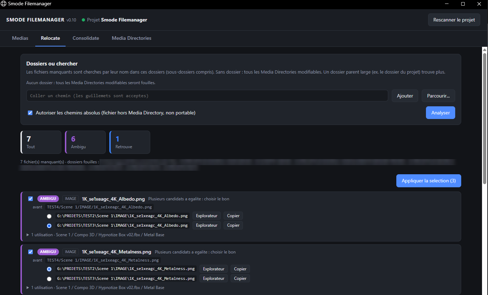
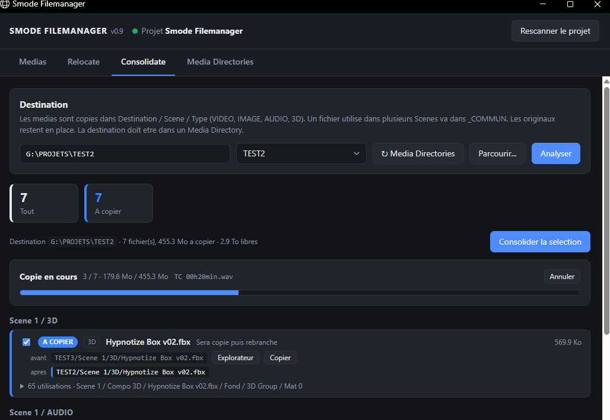
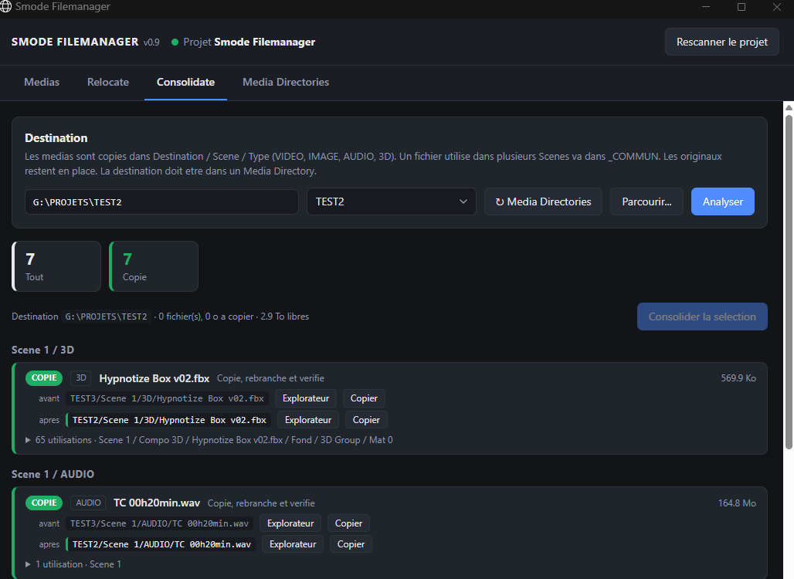

# Smode Filemanager

*[English version](README.md)*

> **Expérimental, pas un outil officiel Smode.** Construit par essais et erreurs sur l'API Oil (voir [smode-oil-reference](https://github.com/gyomh/smode-oil-reference)). Testé sur Smode Compose R15. La GUI est en français ou en anglais (sélecteur en haut à droite) ; le script classique et son rapport sont en français.

Smode n'a ni fonction de relink ni consolidate structuré. Ce dépôt ajoute les deux :

- **Relocate** : retrouve les fichiers manquants du projet (`<Missing File>`) même s'ils ont été déplacés **et**
  répartis autrement sur le disque. Chaque fichier est cherché par son nom ; si plusieurs fichiers portent ce nom,
  celui dont les dossiers ressemblent le plus à l'ancien chemin gagne ; une vraie égalité est signalée comme ambiguë.
  Un fichier trouvé hors de tout Media Directory peut être rebranché en chemin absolu (option).
- **Consolidate** : copie tous les médias utilisés par le projet dans
  `Destination / <nom de la Scene> / VIDEO | IMAGE | AUDIO | 3D`, met les fichiers partagés entre plusieurs Scenes
  dans `_COMMUN`, puis rebranche le projet sur les copies. Les originaux restent en place, une copie identique déjà
  présente est réutilisée, deux fichiers différents de même nom reçoivent un suffixe ` (2)`, les packs Smode en
  lecture seule sont ignorés.

Deux versions du même outil :

| Fichier | Interface |
|---|---|
| `Smode_Filemanager_GUI.py` (**recommandé**) | Une vraie fenêtre d'application servie par le Script lui-même |
| `Smode_Filemanager.py` | Panneau de paramètres du Script + rapport HTML ouvert dans le navigateur |

## Smode_Filemanager_GUI.py

Le Script embarque un petit serveur web sur `127.0.0.1:8893` (cette machine seulement) et ouvre l'interface dans une
fenêtre d'application (Microsoft Edge en mode `--app`, sans barre d'adresse). Smode continue de tourner pendant qu'on
s'en sert : la recherche sur le disque et les copies se font en arrière-plan.

Le sélecteur **FR / EN** en haut à droite change la langue de toute l'interface (mémorisée ; par défaut, celle de
Windows).

Le voyant à côté du nom du projet indique le lien avec Smode : **vert** = connecté, **orange** = le Script ne tourne
plus (projet fermé, Script supprimé ou pas en *At Every Update*), **rouge** = serveur injoignable.

### Medias

Tous les fichiers du projet avec leur état (OK, manquant, chemin absolu, pack Smode), des tuiles de compteurs qui
filtrent la liste, une recherche avec portée (nom du fichier + Scene, nom du fichier, Scene, chemins, partout), les
Scenes qui utilisent le fichier, sa taille, et des boutons « Explorateur » / « Copier ».

### Relocate

Ajouter les dossiers où chercher (sélecteur de dossier Windows ou chemin collé, guillemets acceptés), cliquer sur
**Analyser**, cocher ce qu'on applique, **choisir le bon candidat pour les fichiers ambigus**, puis appliquer la
sélection. Les fichiers que Smode n'a pas encore indexés sont revérifiés automatiquement.

| 1. Fichiers manquants, absents des Media Directories | 2. Après ajout du dossier où ils se trouvent maintenant | 3. Appliqué |
|:---:|:---:|:---:|
|  |  |  |

Quand plusieurs fichiers portent le même nom et qu'aucun n'est plus proche de l'ancien chemin, le fichier est marqué
**ambigu** : choisir le bon candidat (le bouton « Explorateur » aide à vérifier) ; il ne peut être appliqué qu'ensuite.

### Consolidate

Choisir la destination (sélecteur de dossier ou liste de vos Media Directories, qui affiche celui qui contient la
destination), cliquer sur **Analyser** : le plan est groupé par Scene / type, avec le total à copier et l'espace libre
sur le disque de destination. **Consolider la sélection** copie en arrière-plan avec une barre de progression et un
bouton Annuler ; une copie annulée ou en erreur ne laisse aucun fichier partiel.

| 1. Plan (Scene / type, taille, espace libre) | 2. Copie en cours | 3. Terminé, projet rebranché sur les copies |
|:---:|:---:|:---:|
|  |  |  |

### Installation

1. Glisser `Smode_Filemanager_GUI.py` dans le projet Smode (Script) et régler **Launch Mode = At Every Update**.
2. La fenêtre s'ouvre toute seule (option **Auto Open**) ; sinon cocher **Open Interface**.
3. Tout le reste se fait dans la fenêtre. Si le port 8893 est déjà pris, l'erreur s'affiche dans **Status** : changer
   **Port**.

La destination d'un Consolidate **doit être dans un Media Directory** : l'ajouter d'abord dans Smode, puis utiliser
le bouton « ↻ Media Directories » (Smode enregistre la liste quelques secondes après l'ajout ; la fenêtre la relit
aussi toute seule tant que la destination est refusée).

Relocate et Consolidate modifient le projet en mémoire : **enregistrer le projet Smode** (Ctrl+S) ensuite.

## Smode_Filemanager.py

Mêmes Relocate et Consolidate, pilotés depuis les paramètres du Script (sections GENERAL / RELOCATE / CONSOLIDATE /
RAPPORT) : choisir un **Mode**, remplir **Search Folders** ou **Consolidate Folder**, Execute pour obtenir le rapport
HTML, puis cocher **Apply Changes** et relancer Execute. Launch Mode = Manual. Les copies se font pendant l'Execute
(Smode attend). Après un Consolidate, relancer Execute une ou deux fois jusqu'à ce que tout soit *déjà consolidé*.

## Limites

- Les fichiers manquants sont retrouvés **par leur nom** : si le vrai fichier a disparu et qu'un autre fichier du même
  nom existe ailleurs, il sera proposé. Vérifier la liste avant d'appliquer (décocher ce qui est faux).
- Le scan du projet passe par Smode : sur un gros projet, Smode se fige quelques secondes à chaque scan. À éviter
  pendant un spectacle.
- Les fichiers référencés *à l'intérieur* d'un fichier 3D (textures externes d'un FBX) et les séquences d'images ne
  sont pas gérés.
- Windows uniquement (Edge, Explorateur et sélecteur de dossier PowerShell pour la GUI).

## Licence

MIT — voir [LICENSE](LICENSE).
