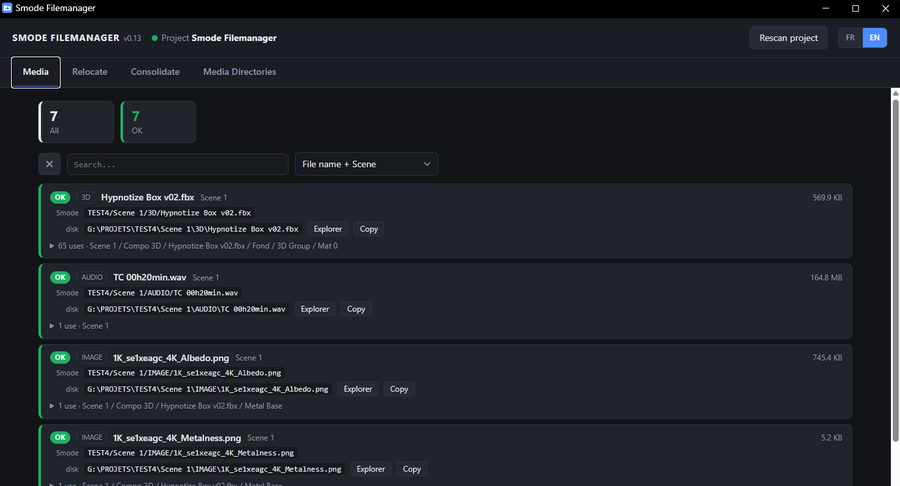
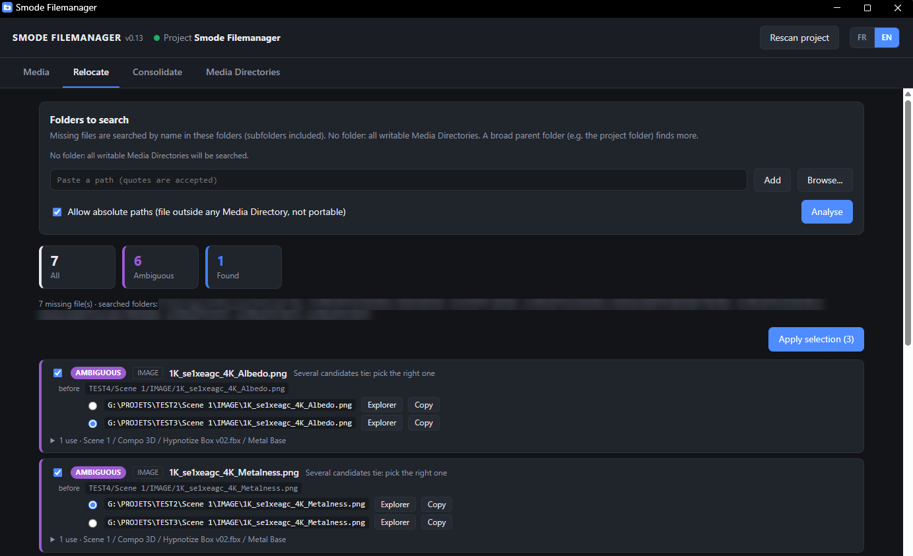
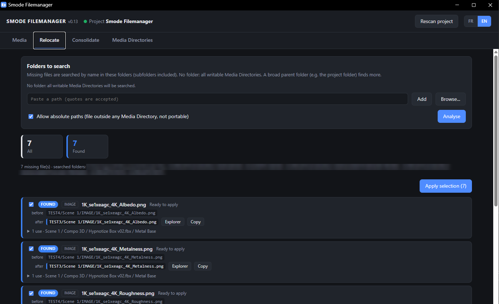
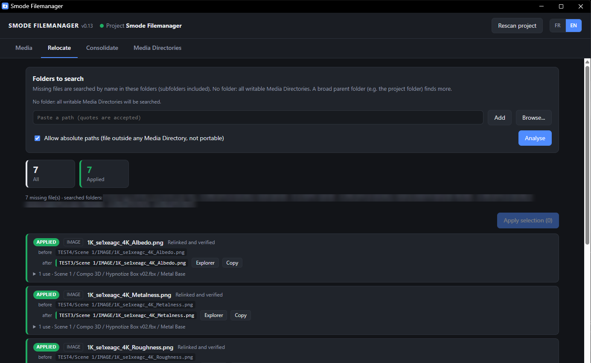
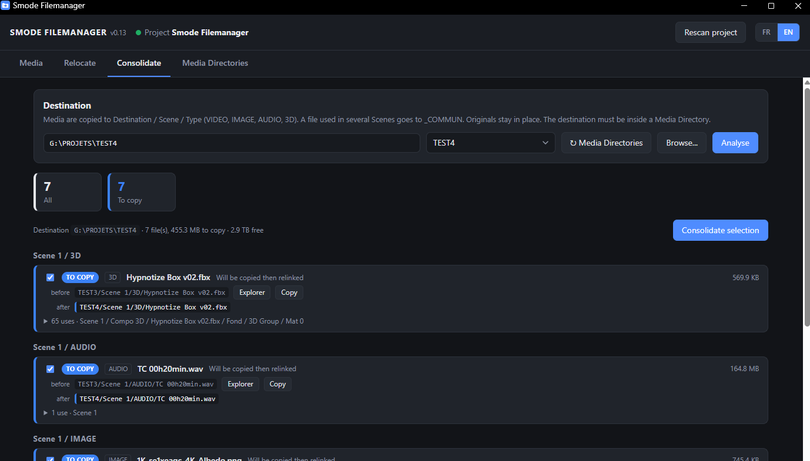
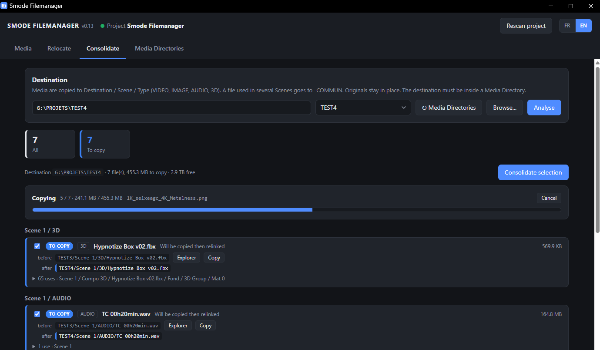
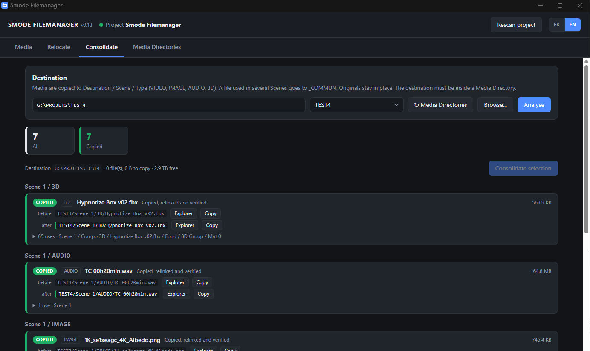

# Smode Filemanager

*[Version française](README.fr.md)*

> **Experimental, not an official Smode tool.** Built by trial and error against the Oil API (see [smode-oil-reference](https://github.com/gyomh/smode-oil-reference)). Tested on Smode Compose R15. The GUI is in English or French (selector at the top right); the classic script and its report are in French.

Smode has no relink function and no structured consolidate. This repository adds both:

- **Relocate**: finds the missing files of the project (`<Missing File>`) even when they were moved **and**
  reorganised differently on disk. Each file is searched by name; when several files share that name, the one whose
  folders best match the old path wins; a real tie is reported as ambiguous. A file found outside any Media
  Directory can be relinked with an absolute path (option).
- **Consolidate**: copies every media the project uses into
  `Destination / <Scene name> / VIDEO | IMAGE | AUDIO | 3D`, puts files shared by several Scenes in `_COMMUN`, then
  relinks the project to the copies. Originals stay in place, an identical copy already present is reused, name
  collisions get a ` (2)` suffix, Smode's read-only packs are skipped.

Two versions of the same tool:

| File | Interface |
|---|---|
| `Smode_Filemanager_GUI.py` (**recommended**) | A real application window served by the Script itself |
| `Smode_Filemanager.py` | Script parameters panel + an HTML report opened in the browser |

## Smode_Filemanager_GUI.py

The Script embeds a small web server on `127.0.0.1:8893` (this machine only) and opens the interface in an
application window (Microsoft Edge `--app` mode, no address bar). Smode keeps running while you work in it: the disk
search and the file copies happen in the background.

The **FR / EN** selector at the top right switches the language of the whole interface (remembered; the default
follows the Windows language).

The dot next to the project name shows the link with Smode: **green** = connected, **orange** = the Script no longer
runs (project closed, Script removed or not in *At Every Update*), **red** = server unreachable.

### Medias

Every file of the project with its state (OK, missing, absolute path, Smode pack), counter tiles that filter the
list, a search box with a scope (file name + Scene, file name, Scene, paths, everywhere), the Scenes that use the
file, its size, and "Explorer" / "Copy" buttons.

### Relocate

Add the folders to search (Windows folder picker or a pasted path, quotes accepted), click **Analyse**, tick what
to apply, **pick the right candidate for ambiguous files**, then apply the selection. Files Smode has not indexed
yet are re-checked automatically.

| 1. Analysis: ambiguous files, pick the right candidate | 2. All found, ready to apply | 3. Applied |
|:---:|:---:|:---:|
|  |  |  |

When several files share the name and none of them is closer to the old path, the file is marked **ambiguous**:
pick the right candidate (the "Explorer" button helps to check), and only then can it be applied (step 1 above).

### Consolidate

Choose the destination (folder picker or the list of your Media Directories, which shows the one containing the
destination), click **Analyse**: the plan is grouped by Scene / type, with the total to copy and the free space on
the destination drive. **Consolidate selection** copies in the background with a progress bar and a cancel button;
a cancelled or failed copy leaves no partial file behind.

| 1. Plan (Scene / type, size, free space) | 2. Copy in progress | 3. Done, project relinked to the copies |
|:---:|:---:|:---:|
|  |  |  |

### Install

1. Drag `Smode_Filemanager_GUI.py` into your Smode project (Script) and set **Launch Mode = At Every Update**.
2. The window opens by itself (option **Auto Open**); otherwise tick **Open Interface**.
3. Everything else happens in the window. If port 8893 is taken, the error shows in **Status**: change **Port**.

The destination of a Consolidate **must be inside a Media Directory**: add it in Smode first, then use the
"↻ Media Directories" button (Smode saves the list a few seconds after you add one; the window also re-reads it
automatically while the destination is refused).

Relocate and Consolidate change the project in memory: **save the Smode project** (Ctrl+S) afterwards.

## Smode_Filemanager.py

Same Relocate and Consolidate, driven from the Script parameters (sections GENERAL / RELOCATE / CONSOLIDATE /
RAPPORT): pick a **Mode**, fill **Search Folders** or **Consolidate Folder**, Execute to get the HTML report, then tick
**Apply Changes** and Execute again. Launch Mode = Manual. Copies are done during the Execute (Smode waits). After a
Consolidate, run Execute once or twice more until everything is *already consolidated*.

## Limits

- Missing files are matched **by file name**: if the real file is gone and another file with the same name exists
  elsewhere, it will be proposed. Check the list before applying (untick what is wrong).
- Scanning the project goes through Smode: on a large project, Smode pauses for a few seconds at each scan. Avoid
  running it during a show.
- Files referenced *inside* a 3D file (external FBX textures) and image sequences are not handled.
- Windows only (Edge, Explorer and PowerShell folder picker for the GUI).

## License

MIT — see [LICENSE](LICENSE).
